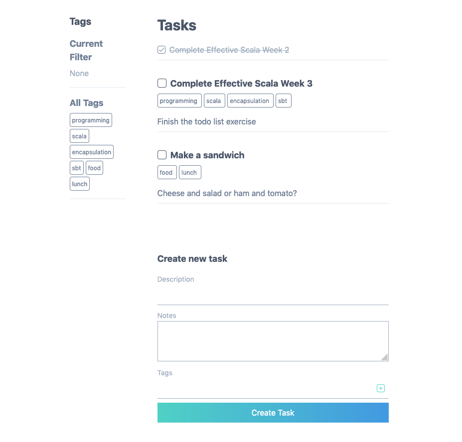

# Todo List

In this assignment we will build a simple todo list application. We have created
a web based front end, and parts of the back end for the application. You will
be responsible for completing the back end to finish the project.


## Open the Project

Download the handout archive, extract it somewhere on your filesystem, and open the
directory `todo` in your code editor.


## Running the Project

Run sbt within the `todo` directory. From the sbt prompt run the `run` command.
This will start a web server. In a web browser go to `http://localhost:3000/`
and you should see the todo list application's interface. 



Try using the interface; you should quickly realise it does not work. We need to
fix it!


## Missing Dependencies

The first problem is that the project is missing a dependency. We learned how to
add sbt dependencies this week.

To make the code compile without this dependency we added a fake implementation
in the file `src/main/scala/todo/CirceShim.scala`. Delete this file.

Now add the missing dependency. You will need to add a dependency on

```scala
("io.circe" %% "circe-parser" % CirceVersion).cross(CrossVersion.for3Use2_13)
```

in `build.sbt`

We need to call `.cross(CrossVersion...)` on the dependency coordinates
because the version of Circe used in this assignment was published for
Scala 2, but we are using Scala 3 here.

sbt should automatically reload once you change the `build.sbt` file. If this
does not happen you can give sbt the `reload` command. Also, in case you use
an IDE (such as Metals or IntelliJ), make sure you re-import the project. In
VS Code, execute the “Import build” command through the command palette
(`Cmd` + `Shift` + `P`, or `Ctrl` + `Shift` + `P`). In IntelliJ, click on the
“sbt” tool window, and then “Reload All sbt Projects”.

Once you have correctly added the dependency some, but not all, of the user
interface will start working correctly.


## Overview of the Code Base

The code consists of four components, in the `src/main/scala/todo` directory:

- `Main.scala`, which brings everything together and runs the webserver;

- the services in `TodoService.scala` and `AssetService.scala`, which respond to
  HTTP requests;

- the models in `InMemoryModel.scala` and `PersistentModel.scala`, which
  implement the application logic and have a common interface defined in
  `Model.scala`; and

- the data definitions in the `data` subpackage.

We'll focus on the models. We won't need to change other code for the most part.
Don't be afraid to look at the other code, however. It will help reinforce some
of the lessons you have already learned.


## Fix the In-Memory Model

Run the tests from sbt (the `test` command). You'll see the tests are currently
failing. Start first on the tests for the `InMemoryModel`. 

Take a look at the code in `InMemoryModel.scala`. We have provided part of an
implementation for you but it contains mistakes. You will need to fix the
implementation to make the tests pass. 

Hint: Your fixes should only be a few lines of code, and only about half the
methods need correcting. The code you will be writing will use your knowledge of
the collection classes that you have previously learned about. If you find
yourself writing a lot of code you have probably made a mistake.

When you have fixed `InMemoryModel` you will have a working application!


## Fix the Persistent Model

The `InMemoryModel` loses any changes you make each time you restart the server.
A more useful system would persist changes between runs. This is what
`PersistentModel` does. Here we have provided a few useful utilities for you,
but you'll have to do much more of the work required to get it working.

Once you have got the `PersistentModel` working, change `Main` (in the `app`
method) to use it instead of the `InMemoryModel`. Now you have a personal todo
list application that saves tasks between runs. Pretty cool!
